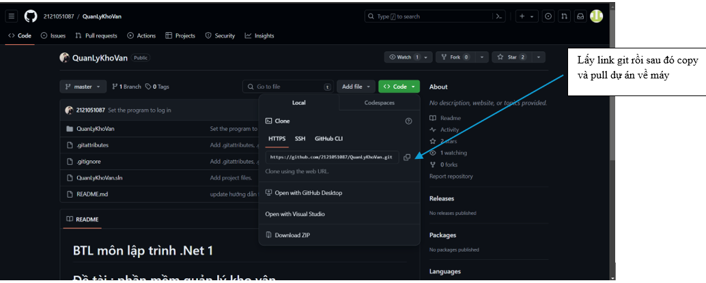
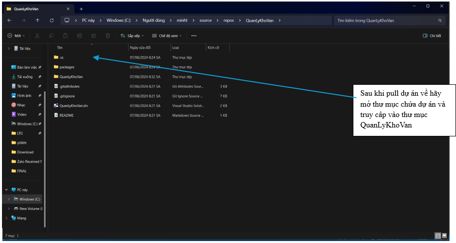
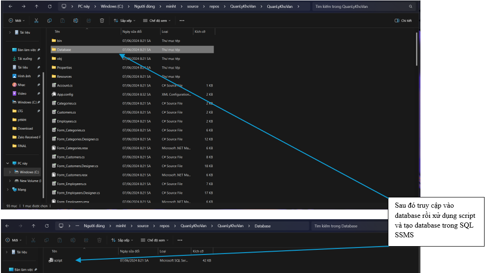
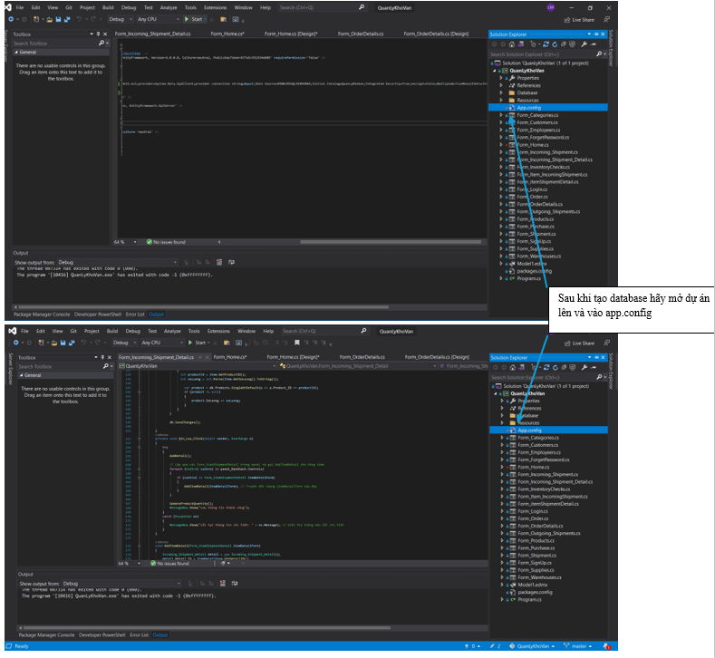
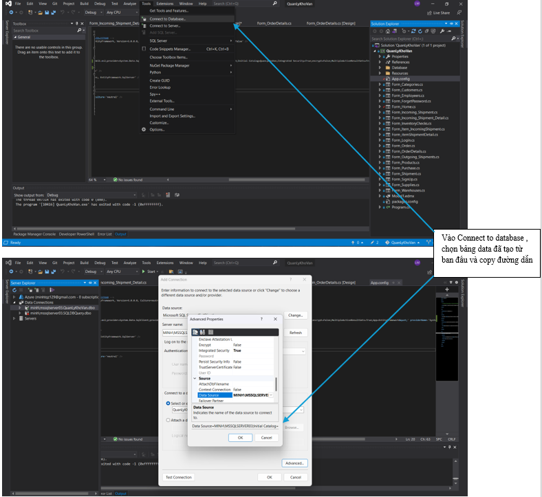
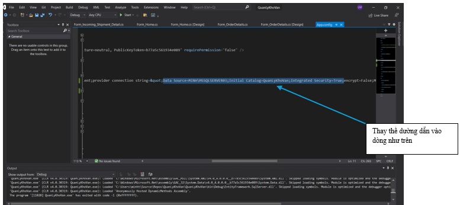
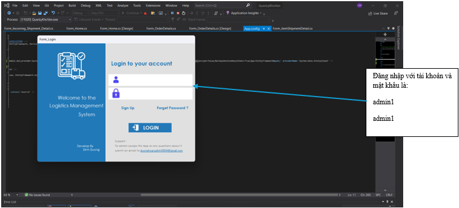

# BTL môn lập trình .Net 1

# Đề tài :  phần mềm quản lý kho vận 

 

## 1.Cài Đặt
 ### Yêu cầu : 
  - Microsoft SQL sever Management Studio 2012 trở lên (ssms)
  - .Netframework 4.7.2 
  - Sử dụng Microsoft visual studio .

## B1

## B2

## B3

## B4

## B5

## B6

## B7

